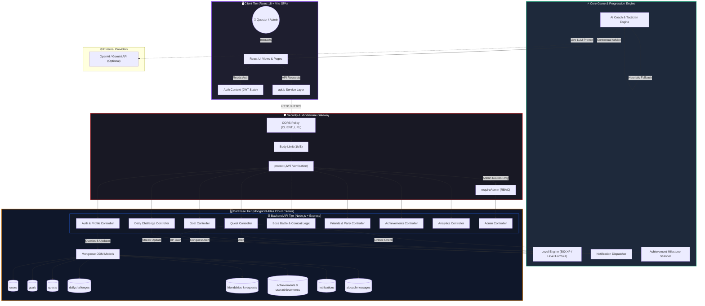

# LifeForge: System Architecture

This document visualizes the complete system architecture, data flow, and component interactions of the LifeForge RPG Productivity Platform.

---

## 1. High-Level System Architecture Diagram

---

## 2. Key Component Explanations

1. **Client Tier**:
   * Built with React 18, Vite, and Tailwind CSS.
   * State is managed through React Context (`AuthContext`) with zero tokens exposed in local files.
   * `api.js` serves as the single source of truth for all HTTP calls with dynamic URL resolution.
2. **Security & Gateway Tier**:
   * **CORS**: Enforces origin whitelisting in production via `CLIENT_URL`.
   * **Body Limit**: Restricts payloads to `1mb` to eliminate memory buffer exploits.
   * **Authentication**: Verifies JWT tokens and immediately blocks suspended accounts.
   * **RBAC**: Ensures admin routes are protected against client-side role forgery.
3. **Backend API Tier**:
   * Modular Express router and controllers strictly enforcing user data isolation (`userId: req.user._id`).
   * Clean RESTful conventions with appropriate HTTP response codes (`200`, `201`, `400`, `401`, `403`, `404`, `500`).
4. **Game & Progression Engine**:
   * **LevelService**: Calculates character level deterministically based on `500 XP` per level thresholds.
   * **AchievementService**: Scans user progress triggers after every quest or goal completion to automatically award trophies.
   * **NotificationService**: Generates activity feed entries for streaks, boss strikes, and party updates.
   * **AI Coach Service**: Combines user state (goals, quests, streaks) with prompts. Features automatic fallback if external API is unreachable.
5. **Database Tier**:
   * MongoDB replica set hosted on MongoDB Atlas.
   * Enforces schema validation, unique indexes (e.g. one daily challenge per date, unique email/username), and cascaded subdocuments.
